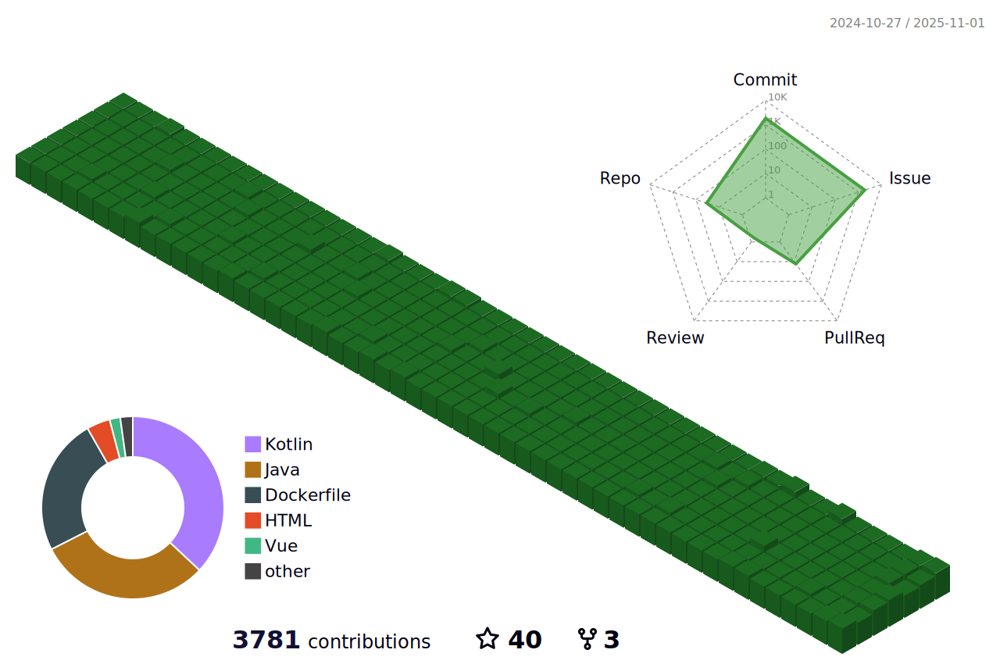

<h2 align="center">👋 Hello! I'm Hojjat.</h2>

  
  

  
  
  
  
  
  
  
  
  
  

  

  

  

  
  
  

  
  

  
  

### :memo: Recent Blog Posts

<!-- feed start -->
- Dec. 27, 2021 - [Enable old TSL\SSL protocol on Java](https://blog.glinboy.com/2021/12/enable-old-tsl-ssl-protocol-on-java.html)
- Nov. 25, 2021 - [Get user IP in Spring Boot](https://blog.glinboy.com/2021/11/get-user-ip-in-spring-boot.html)
- Nov. 19, 2021 - [Convert file to base64 on fron-end in VueJS](https://blog.glinboy.com/2021/11/convert-file-to-base64-on-fron-end-in-vuejs.html)
- Nov. 18, 2021 - [Make rows clickable in VueJS table with ignore a column(s)](https://blog.glinboy.com/2021/11/make-rows-clickable-in-vuejs-table-with-ignore-a-column.html)
- Feb. 23, 2021 - [Get user roles from Keycloak in Spring/Jhipster](https://blog.glinboy.com/2021/02/roles-spring-jhipster-keycloak.html)
<!-- feed end -->

  

